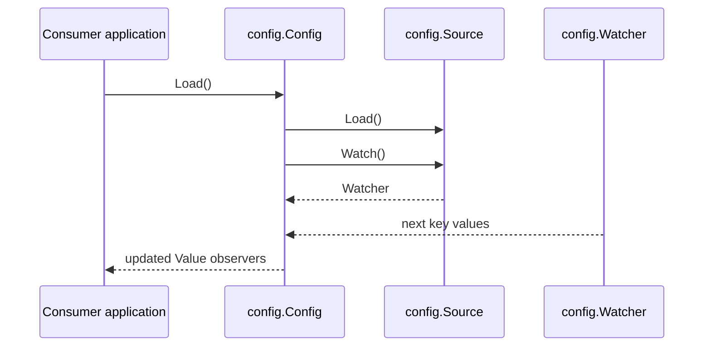
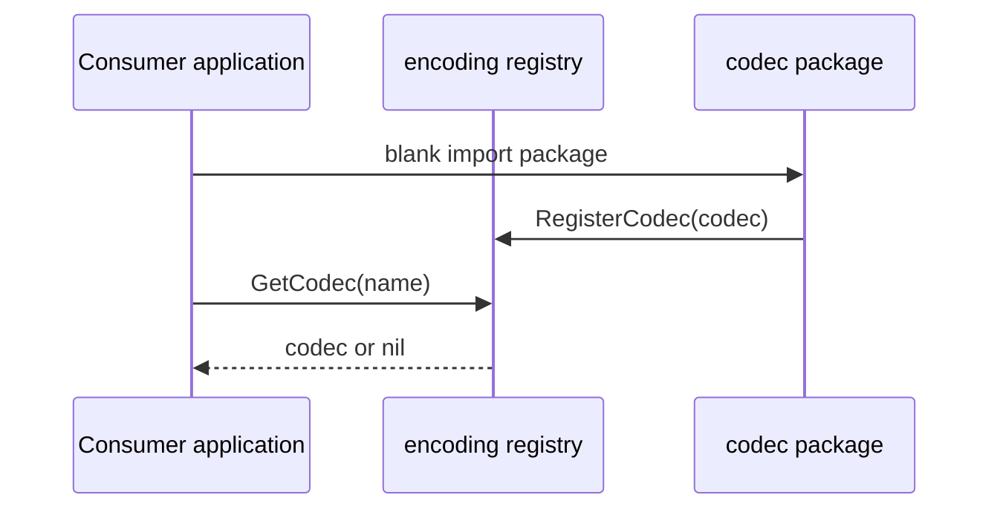
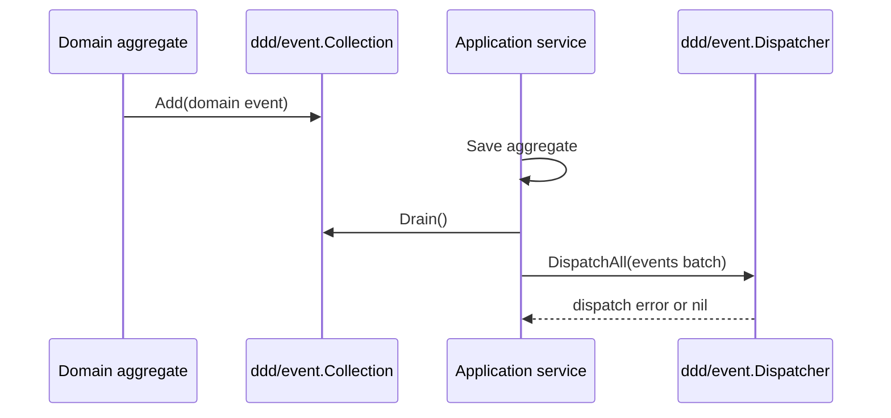
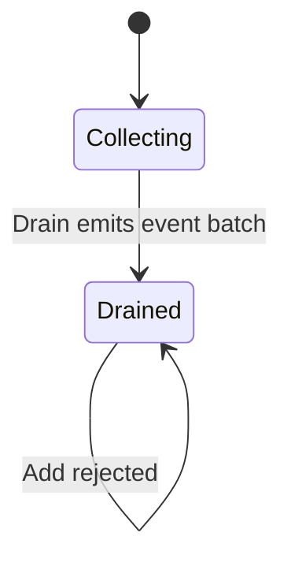

# Architecture

## Pattern Overview

This repository is a public Go component library. Packages are organized as
small top-level capabilities instead of an application with service entry
points, deployment manifests, or bounded-context folders.

The current event branch keeps the existing `mediator` package compatible and
adds a DDD concept namespace under `ddd/`.

## System Context

- Library consumers import individual packages from `github.com/go-jimu/components`.
- GitHub Actions runs tests, benchmarks, and coverage on pull requests and master.
- Codecov receives the generated `coverage.txt` artifact.

## Layering

- `config/` — configuration loading, resolving, merging, watching, and typed value access. Key abstraction: `Config`.
- `encoding/` — codec registry plus JSON/YAML/TOML/Protobuf codec packages. Key abstraction: `Codec`.
- `fsm/` — finite state machine primitives and transition checks. Key abstractions: `State`, `StateContext`, `StateMachine`.
- `logger/` and `sloghelper/` — logger adapters and helpers for `log/slog`.
- `mediator/` — existing in-process event mediator with global default, event collection, subscription, dispatch, and graceful shutdown.
- `ddd/event/` — DDD-oriented domain event collection, batch dispatch, and handler subscription. Key abstractions: `Event`, `Collection`, `Dispatcher`, `Subscriber`, `Bus`, `Handler`.
- `validation/` — notification and specification validation helpers.
- `docs/superpowers/specs/` and `docs/superpowers/plans/` — design and implementation records for planned or recently completed work.

There is no application-layer call graph. Consumers compose these packages in
their own applications.

## Scenario Sequences

## Key Object FSMs

## Key Design Decisions

- Preserve existing `mediator` API compatibility; add new DDD event module separately. See `decisions.md`.
- Place DDD concept packages under `ddd/`, with `ddd/event` first and future `ddd/message` / `ddd/message/outbox` reserved. See `docs/superpowers/specs/2026-05-10-ddd-event-design.md`.
