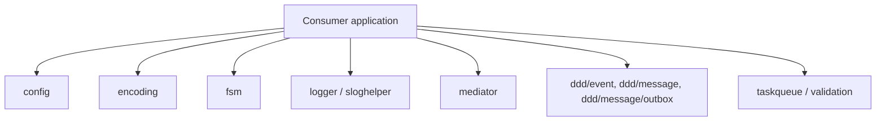
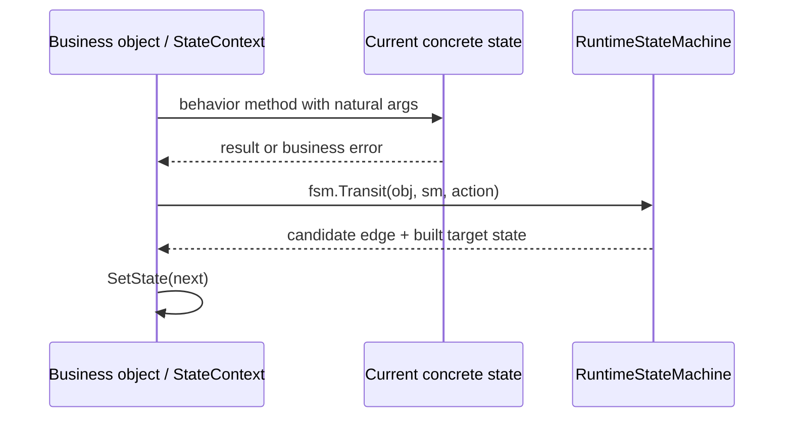
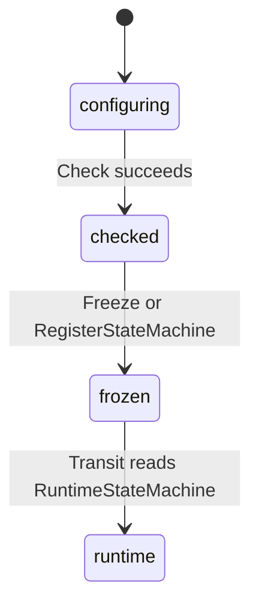

# Architecture

## Pattern Overview

**Overall:** Public Go component library organized as small top-level packages rather than an application with deployable services.

**Key Characteristics:**
- Consumers import individual packages from `github.com/go-jimu/components`.
- There is no application-layer call graph or runtime composition root in this repository.
- DDD-oriented packages live under `ddd/`; legacy compatibility remains in `mediator/`.

Source refs: `README.md`, `docs/project-knowledge/architecture.md`, `docs/superpowers/specs/2026-05-10-ddd-event-design.md`, `docs/superpowers/specs/2026-05-10-integration-message-design.md`, `docs/superpowers/specs/2026-05-10-message-outbox-design.md`.

## System Context

**Actors:**
- Library consumers composing packages in their own Go applications.
- Maintainers running package tests and updating public APIs.

**External Systems:**
- GitHub Actions runs test, benchmark, and coverage workflows.
- Codecov receives repository coverage artifacts.

## System Topology / Context Map

**Call direction rules:**
- Packages are standalone capabilities; consumers own application wiring and runtime lifecycle.
- Domain-oriented packages avoid owning transport, storage, broker, or generated protocol runtime.
- `fsm` owns transition definitions and target-state construction only; consumers own state behavior and the current state field.

## Module Architecture Cards

#### FSM
**Responsibility:** Lightweight finite state machine primitives for polymorphic state objects; does not own business behavior or persistence.
**Path / entry:** `fsm/` via `NewStateMachine`, `Transit`, registry helpers, `State`, `StateContext`, `StateMachine`, `RuntimeStateMachine`.
**Internal layers / components:** build-time `StateMachine`; read-only `RuntimeStateMachine`; `StateBuilder`; `Transition`; registry; typed setup/check errors.
**Interactions:** Consumer aggregate/business object implements `StateContext`; `Transit` reads candidate transitions, evaluates guards, builds target state, sets context, and delegates assignment to `SetState`.
**State / invariants:** Configured machines can be `Freeze`d; registry validates and freezes build-time machines; builders must return non-nil states with matching labels.
**Source refs:** `fsm/README.md`, `fsm/doc.go`, `fsm/types.go`, `fsm/state_machine.go`, `fsm/transit.go`, `fsm/example_test.go`.

#### DDD Event
**Responsibility:** Domain event collection, batch dispatch, and handler subscription for same bounded-context reactions.
**Path / entry:** `ddd/event/`.
**Internal layers / components:** `Event`, `Collection`, `Dispatcher`, `Subscriber`, `Handler`, `InMemoryDispatcher`.
**Interactions:** Aggregates collect events; application services persist aggregate state, drain events, then dispatch.
**State / invariants:** Dispatch errors represent admission or delivery failure, not handler business failure.
**Source refs:** `docs/superpowers/specs/2026-05-10-ddd-event-design.md`, `docs/superpowers/plans/2026-05-10-ddd-event-implementation.md`, `docs/project-knowledge/features.md`.

#### Integration Message
**Responsibility:** Transport-neutral integration message DTOs and routing helpers for cross bounded-context or service boundaries.
**Path / entry:** `ddd/message/`.
**Internal layers / components:** `Message`, `Kind`, `Publisher`, `Subscriber`, `Handler`, `Router`, `PayloadResolver`, `PayloadRegistry`.
**Interactions:** Application or infrastructure mapping code creates messages; provider packages map semantic message data into broker envelopes.
**State / invariants:** Message kind is semantic routing data, not a broker topic or queue name.
**Source refs:** `docs/superpowers/specs/2026-05-10-integration-message-design.md`, `docs/superpowers/plans/2026-05-10-integration-message.md`, `README.md`.

#### Message Outbox
**Responsibility:** Transactional outbox contracts and relay runtime for reliable integration message publishing.
**Path / entry:** `ddd/message/outbox/`.
**Internal layers / components:** `Record`, `Store`, `Recorder`, `Codec`, `RetryPolicy`, `Relay`.
**Interactions:** Application/infrastructure records outbound messages durably; relay publishes with retry policy.
**State / invariants:** Reliability mechanics stay in outbox infrastructure contracts, separate from domain event semantics.
**Source refs:** `docs/superpowers/specs/2026-05-10-message-outbox-design.md`, `docs/superpowers/plans/2026-05-10-message-outbox.md`.

## Named Scenario Sequences

### FSM consumer transition

**Source refs:** `fsm/README.md`, `fsm/example_test.go`, `AGENTS.md`.

## Key Object FSMs

### FSM machine lifecycle

**Source refs:** `fsm/state_machine.go`, `fsm/registry.go`, `fsm/types.go`.

## Key Design Decisions

- **FSM state polymorphism** — behavior belongs on concrete state methods; transition tables only select target states. See `AGENTS.md` and `fsm/README.md`.
- **Runtime surface separation** — configured machines can be frozen into `RuntimeStateMachine` so runtime code cannot mutate transition definitions. See `fsm/types.go`.
- **DDD packages separate event and integration-message semantics** — same-context domain events and cross-context integration messages are different concepts. See `README.md` and DDD specs.
